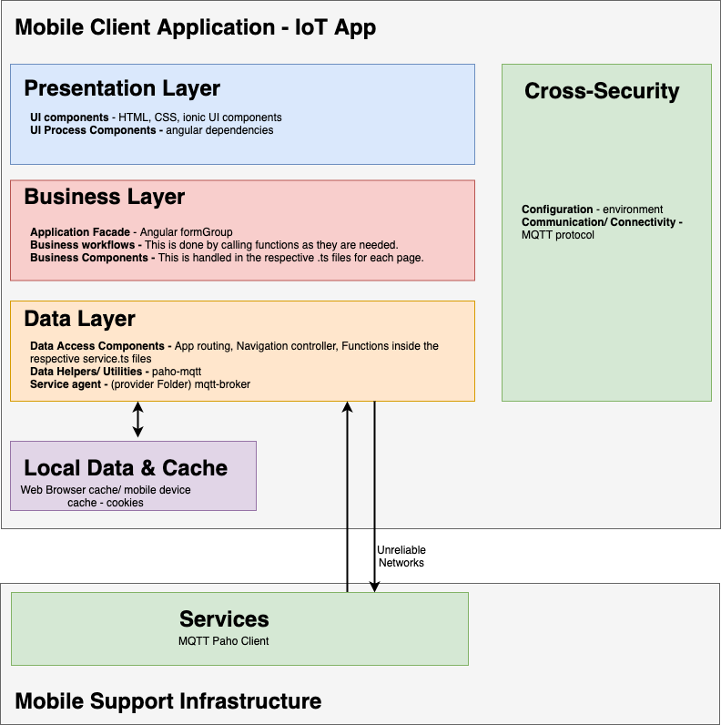
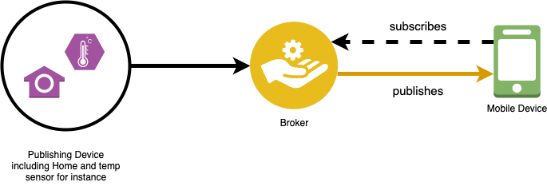

# README - IoT App

Link to the video demonstration:
https://youtu.be/d4DuMsvEmAk

## IoT App - App Description
* This IoT App acts by subscribing to a published topic service from a MQTT broker to emulate sensor values from IoT devices. 
* Application built in Typescript (subset of JavaScript) using the Ionic framework - Angular orientated.

## Architecture

### Application

### MQTT
Message Queuing Telemetry Transport protocol

using Eclipse Paho Client
https://www.eclipse.org/paho/clients/python/

